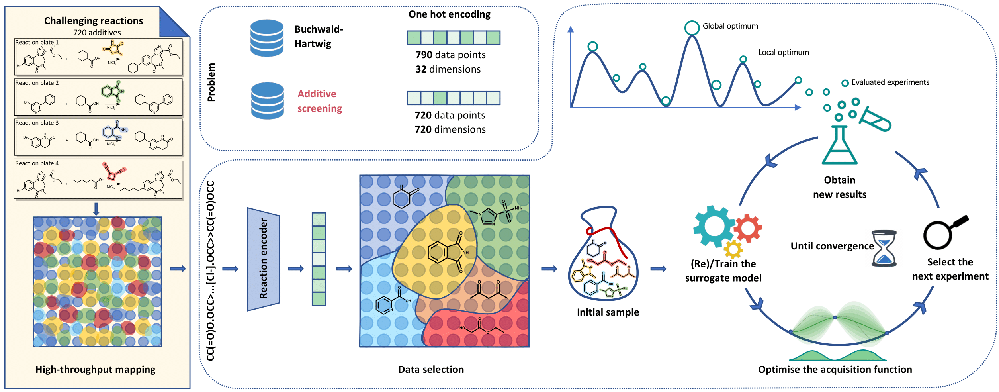

<!-- These are examples of badges you might want to add to your README:
please update the URLs accordingly -->

[](https://cirrus-ci.com/github/<USER>/additive-bo)
[](https://additive-bo.readthedocs.io/en/stable/)
[](https://coveralls.io/r/<USER>/additive-bo)
[](https://pypi.org/project/additive-bo/)
[](https://anaconda.org/conda-forge/additive-bo)
[](https://twitter.com/additive-bo)
[](https://pyscaffold.org/)

---

# CHAOS: Chemical additives optimization screening

**chaos** leverages Bayesian optimization to optimize additives for chemical reactions.

At the heart of CHAOS lies a robust Bayesian optimization engine. By harnessing the power of probabilistic modeling, we are able to efficiently search through the vast chemical space for optimal additives. Bayesian optimization balances exploration and exploitation, effectively narrowing down the vast chemical space to the most promising areas.

Buit on top of Gauche, it provides diverse compound and reaction representations together with custom Gaussian process kernel functions.


---

## 🚀 Installation

To install the package we recommend using a conda environment:

```bash
$ conda env create --file environment.yaml
pip install rxnfp --no-deps
```

## 💪 Getting Started
To configure an optimization routine check the config.yaml file, update parameters and use:
```python
python train_cli.py --config run_config.yaml
```
To run a wandb sweep use the parameters from sweep_config.yaml to initialize the sweep.

## 👋 Contributing

Contributions, whether filing an issue, making a pull request, or forking, are appreciated.

##  Attribution

### ⚖️ License

The code in this package is licensed under the MIT License.

### 📖 Citation

Citation goes here!

### 🛠️ Making Changes & Contributing

This project uses [pre-commit](https://pre-commit.com/), please make sure to install it before making any changes:


<p align="center">
  
</p>


<h1 align="center">
  Bayesian optimization for additives screening
</h1>
